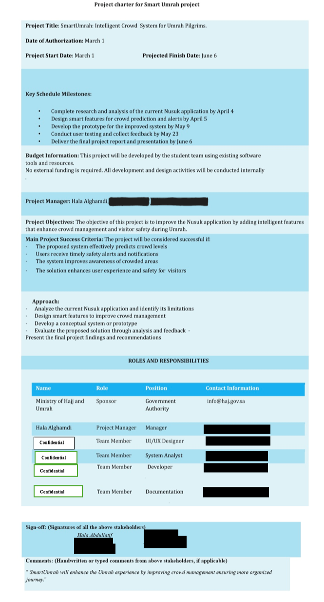
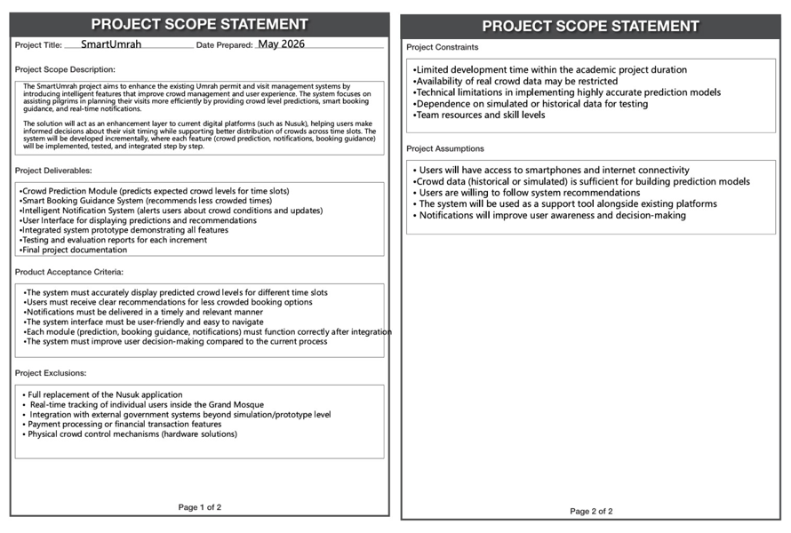
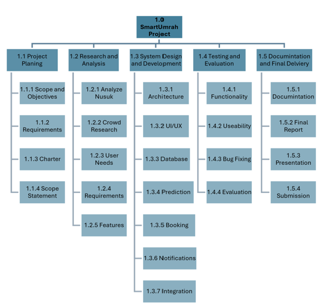
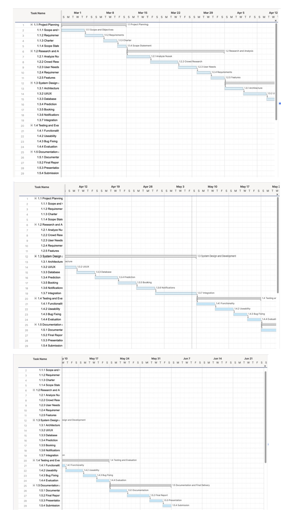
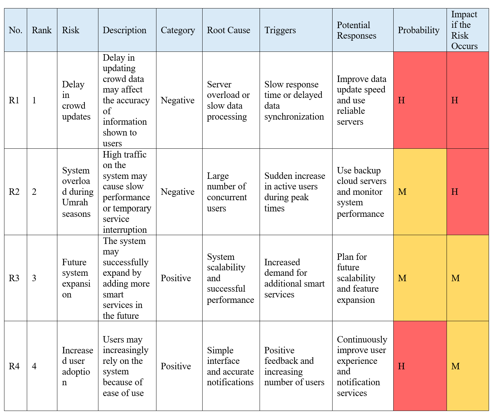

# SmartUmrah

A project management case study proposing a smart Umrah planning application that improves the pilgrim experience through strategic planning and user-centered features.

---

## Project Overview

SmartUmrah is a proposed mobile application designed to simplify the Umrah journey by helping pilgrims plan their trips more efficiently.

The project applies project management methodologies to define project scope, schedule, risks, deliverables, and documentation while proposing user-centered features that improve the overall pilgrimage experience.

---

## Objectives

- Improve the Umrah planning experience
- Reduce planning complexity
- Provide personalized guidance
- Demonstrate complete project management documentation

---

## Proposed Features

- Personalized Umrah planning
- Crowd prediction
- Booking guidance
- Smart notifications

---

## Project Deliverables

- Project Charter
- Scope Statement
- Work Breakdown Structure (WBS)
- Gantt Chart
- Risk Register
- Final Project Report
- Project Presentation

---

## Project Documentation

- 📄 Project Report: `docs/SmartUmrah_Project_Report.pdf`
- 📊 Presentation: `docs/SmartUmrah_Project_Presentation.pdf`

---

## Project Images

### Project Charter

---

### Scope Statement

---

### Work Breakdown Structure

---

### Gantt Chart

---

### Risk Register

---

## Tools Used

- Microsoft Project
- Microsoft Word
- Microsoft PowerPoint

---

## Author

**Hala Alghamdi**

Computer Science Student

Princess Nourah University
